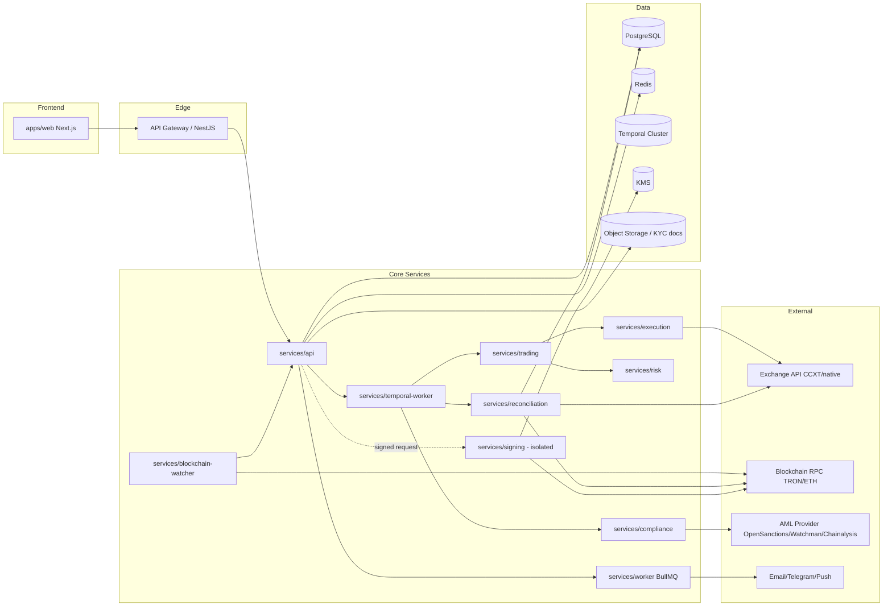
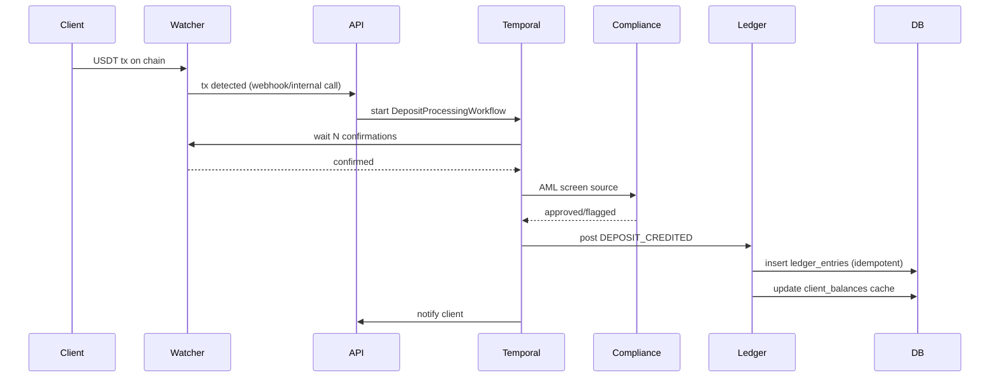
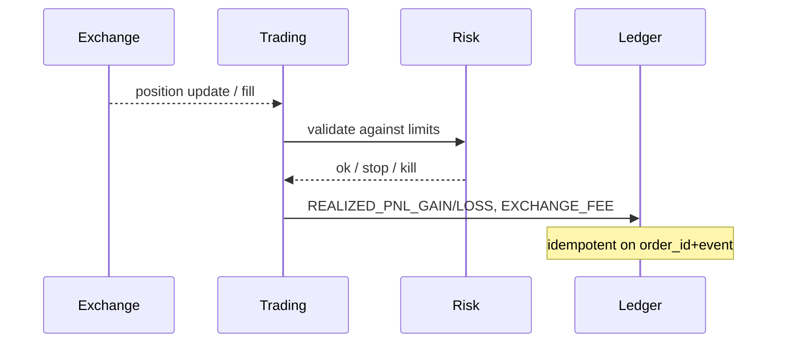

# Architecture

> Source of truth: ТЗ v1.5 разделы 22, 26.3, 41.

---

## 1. Service Map

---

## 2. Boundaries (раздел 41 ТЗ)

- **apps/web** — Next.js клиент + админка. Не содержит бизнес-логики.
- **services/api** — REST/GraphQL API gateway, auth, RBAC, rate limiting.
- **services/temporal-worker** — durable workflows (раздел 23.4 ТЗ).
- **services/worker** — BullMQ для некритичных задач.
- **services/trading** — bot orchestration, strategy execution.
- **services/risk** — изолированный risk engine, kill switch.
- **services/execution** — отправка ордеров на биржу, idempotency.
- **services/blockchain-watcher** — отслеживание депозитов/выводов в blockchain.
- **services/reconciliation** — daily reconciliation jobs.
- **services/compliance** — KYC/AML интеграции.
- **services/signing** — изолированный signing service (раздел 21.1 ТЗ).
- **packages/db** — Prisma/Drizzle schema + migrations.
- **packages/ledger** — LedgerService (double-entry primitives).
- **packages/risk** — risk rules library.
- **packages/exchange** — ExchangeAdapter interface.
- **packages/shared** — типы, утилиты, error classes.
- **packages/ui** — React component library (shadcn/ui).
- **packages/config** — env schema, feature flags.

---

## 3. Event flow (deposit example)

---

## 4. Critical workflows (Temporal — раздел 23.4 ТЗ)

- DepositProcessingWorkflow
- WithdrawalApprovalWorkflow
- WithdrawalSendingWorkflow
- StopTradingWorkflow
- EmergencyShutdownWorkflow
- ReconciliationWorkflow
- FeeCalculationWorkflow
- KycReviewWorkflow
- BotSessionLifecycleWorkflow

---

## 5. Feature flags (раздел 26.3 ТЗ)

Управляются через `packages/config`:

- `realMoneyTrading` — включает реальные ордера (default: false до MVP 4)
- `paperTradingOnly` — все ордера в paper mode
- `withdrawalsEnabled` — глобальный killswitch выводов
- `botEnabled` — глобальный killswitch торговли
- `signalsPublic` — публикация сигналов
- `newDepositsEnabled` — приём новых депозитов
- `kycProvider` — toggle между провайдерами
- `amlProvider` — toggle между провайдерами

Feature flags хранятся в БД + Redis cache, mутации идут через audit log.

---

## 6. Data flow для PnL/funding (sequenceDiagram)

---

## 7. Deployment topology

- **Staging:** все сервисы, отдельный PG+Redis+Temporal cluster, paper trading only.
- **Production:** изолированный VPC, отдельный signing service в подсети без internet egress (только chain RPC через VPN/proxy), KMS, secrets manager.
- **DR:** daily PG backups + WAL shipping, Temporal namespaces backup, runbooks.

---

## 8. Observability

См. ADR-009. SLI/SLO определены для:

- Withdrawal queue depth, age
- Reconciliation status (last successful run)
- Bot heartbeat
- Risk events rate
- Exchange API health
- Blockchain watcher lag
- API latency P50/P95/P99
- Ledger consistency check

Correlation ID (раздел 58.3 ТЗ) пронизывает все слои: API request -> workflow -> ledger entry -> exchange order -> audit record.

---

## 9. Security boundaries

- **Web** — публичный, behind WAF, rate-limited.
- **Admin** — IP allowlist (опционально), step-up 2FA, separate auth.
- **Signing service** — mTLS, no public endpoint, only API can call.
- **DB** — private subnet, encrypted at rest + in transit.
- **Temporal** — internal только.
- **KMS** — выделенный key per environment, rotation policy.

---

## 10. Open questions

- DEC-001: юрисдикция влияет на choice of cloud region (data residency).
- DEC-002: сеть USDT влияет на blockchain-watcher и treasury wallets.
- DEC-006: ledger engine — собственный (текущая рекомендация) или внешний.
- DEC-009: monorepo (pnpm + Turborepo) или polyrepo.
